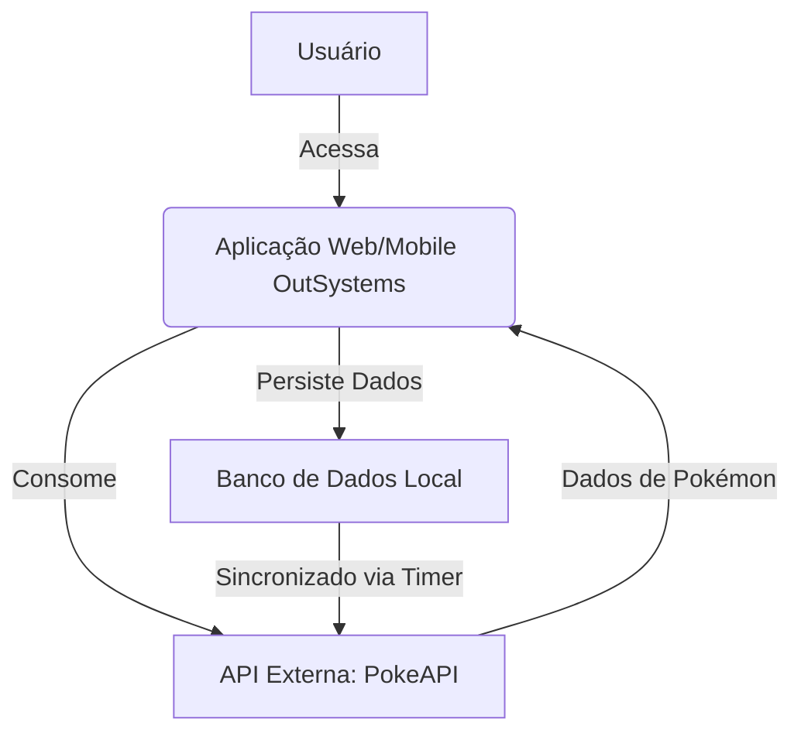
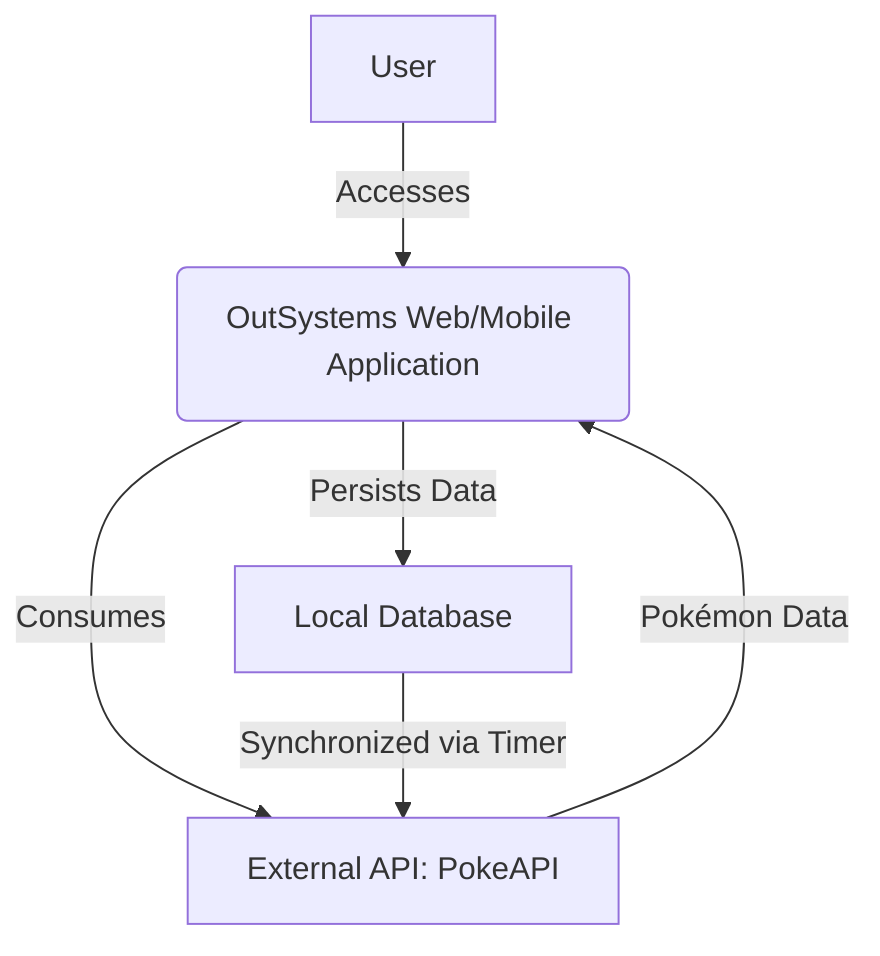

# 🌟 Site Temático com OutSystems – Projeto Final

## 🇧🇷 Português

Este projeto, desenvolvido por Gabriel Demetrios Lafis, representa o encerramento da jornada de aprendizado com OutSystems. O objetivo foi criar um site temático cativante, interativo e cheio de personalidade, unindo **design criativo**, **tecnologia robusta** e **integração com APIs reais**. A entrega inclui versões web e mobile, demonstrando a versatilidade da plataforma OutSystems.

### 🚀 Visão Geral do Projeto

O projeto foca na criação de um site temático utilizando a plataforma OutSystems, com o tema **Pokémon**. A escolha do tema permite uma vasta gama de interações e o uso da [PokeAPI](https://pokeapi.co/) para dados em tempo real, proporcionando uma experiência dinâmica para os fãs da franquia.

### 🧩 Funcionalidades Principais

- 🌐 **Aplicação Web Reactive**: Layout responsivo, adaptado a diferentes tamanhos de tela.
- 📱 **Aplicativo Mobile**: Navegação fluida e compatibilidade com instalação via QR Code (PWA).
- 🧠 **Consumo de API externa**: Sincronização via **Timer** para atualização contínua dos dados no banco local.
- 🛠 **Arquitetura Canvas**: Divisão em camadas com separação de responsabilidades (Core, Services, UI).
- 🎨 **Tema personalizado**: Identidade visual exclusiva do universo Pokémon.
- 🎥 **Integração multimídia**: Vídeos, imagens animadas, efeitos visuais e transições suaves.
- 🔐 **Autenticação de Usuário**: Tela de login e autenticação.
- 🧾 **Tela de Detalhes**: Informações dos personagens e funcionalidades extras.
- 📦 **Banco de Dados Sincronizado**: Dados atualizados via agendamentos inteligentes (timers).

### 📁 Estrutura do Repositório

```
assets/
├── hero-image.png
docs/
├── README.md
├── architecture.mmd
src/
├── SiteTematico_Pokemon.oml
.gitignore
LICENSE
README.md
```

- `src/`: Contém os arquivos fonte do projeto OutSystems (.oml).
- `docs/`: Contém a documentação detalhada do projeto, incluindo o README original e diagramas.
- `assets/`: Recursos visuais como a imagem hero.
- `LICENSE`: O arquivo de licença do projeto.
- `README.md`: Este arquivo, com a documentação bilíngue e visão geral do projeto.

### 🔗 APIs Utilizadas

- [PokeAPI](https://pokeapi.co/) – Utilizada para consumir dados dos Pokémons.

### ⚠️ Limitações e Considerações sobre o Código OutSystems

É importante notar que o arquivo `SiteTematico_Pokemon.oml` é um artefato binário gerado pela plataforma OutSystems. Devido à natureza proprietária e de baixo código da plataforma, as seguintes limitações se aplicam:

- **Aprimoramento Direto do Código**: Não é possível realizar edições diretas ou aprimoramentos no código-fonte dentro do arquivo `.oml` utilizando ferramentas de desenvolvimento convencionais (como editores de texto ou IDEs padrão). Quaisquer modificações devem ser feitas através do ambiente de desenvolvimento OutSystems.
- **Testes Unitários e Validação**: A implementação de testes unitários e validação completa do código-fonte, conforme as práticas de desenvolvimento tradicionais, não é aplicável diretamente ao arquivo `.oml`. A funcionalidade e a qualidade do código são validadas dentro do ambiente OutSystems, que oferece suas próprias ferramentas de depuração e teste.

Este repositório foca na demonstração da estrutura do projeto, documentação e integração com APIs, conforme desenvolvido originalmente por Gabriel Demetrios Lafis na plataforma OutSystems. A funcionalidade do aplicativo é garantida pela execução no ambiente OutSystems.

### 📊 Diagrama de Arquitetura



### 🏅 Badges

<!-- BADGES_PLACEHOLDER -->

### 🖼️ Imagem Hero


[](https://github.com/galafis/Criando-um-Site-Tematico-com-OutSystems/commits/main)
[](https://github.com/galafis/Criando-um-Site-Tematico-com-OutSystems)
[](https://opensource.org/licenses/MIT)


---

## 🇬🇧 English

This project, developed by Gabriel Demetrios Lafis, represents the culmination of a learning journey with OutSystems. The goal was to create a captivating, interactive, and personalized thematic website, combining **creative design**, **robust technology**, and **real API integration**. The delivery includes web and mobile versions, demonstrating the versatility of the OutSystems platform.

### 🚀 Project Overview

The project focuses on creating a thematic website using the OutSystems platform, with a **Pokémon** theme. The choice of theme allows for a wide range of interactions and the use of the [PokeAPI](https://pokeapi.co/) for real-time data, providing a dynamic experience for fans of the franchise.

### 🧩 Key Features

- 🌐 **Reactive Web Application**: Responsive layout, adapted to different screen sizes.
- 📱 **Mobile Application**: Fluid navigation and compatibility with QR Code installation (PWA).
- 🧠 **External API Consumption**: Synchronization via **Timer** for continuous data updates in the local database.
- 🛠 **Canvas Architecture**: Layered division with separation of responsibilities (Core, Services, UI).
- 🎨 **Custom Theme**: Exclusive visual identity from the Pokémon universe.
- 🎥 **Multimedia Integration**: Videos, animated images, visual effects, and smooth transitions.
- 🔐 **User Authentication**: Login screen and authentication.
- 🧾 **Detail Screen**: Character information and extra functionalities.
- 📦 **Synchronized Database**: Data updated via intelligent scheduling (timers).

### 📁 Repository Structure

```
assets/
├── hero-image.png
docs/
├── README.md
├── architecture.mmd
src/
├── SiteTematico_Pokemon.oml
.gitignore
LICENSE
README.md
```

- `src/`: Contains the OutSystems project source files (.oml).
- `docs/`: Contains detailed project documentation, including the original README and diagrams.
- `assets/`: Visual resources such as the hero image.
- `LICENSE`: The project license file.
- `README.md`: This file, with bilingual documentation and project overview.

### 🔗 APIs Used

- [PokeAPI](https://pokeapi.co/) – Used to consume Pokémon data.

### ⚠️ Limitations and Considerations regarding OutSystems Code

It is important to note that the `SiteTematico_Pokemon.oml` file is a binary artifact generated by the OutSystems platform. Due to the proprietary and low-code nature of the platform, the following limitations apply:

- **Direct Code Enhancement**: It is not possible to directly edit or enhance the source code within the `.oml` file using conventional development tools (such as text editors or standard IDEs). Any modifications must be made through the OutSystems development environment.
- **Unit Tests and Validation**: The implementation of unit tests and comprehensive source code validation, according to traditional development practices, is not directly applicable to the `.oml` file. Code functionality and quality are validated within the OutSystems environment, which offers its own debugging and testing tools.

This repository focuses on demonstrating the project structure, documentation, and API integration, as originally developed by Gabriel Demetrios Lafis on the OutSystems platform. The application's functionality is guaranteed by its execution in the OutSystems environment.

### 📊 Architecture Diagram



### 🏅 Badges

<!-- BADGES_PLACEHOLDER -->

### 🖼️ Imagem Hero


[](https://github.com/galafis/Criando-um-Site-Tematico-com-OutSystems/commits/main)
[](https://github.com/galafis/Criando-um-Site-Tematico-com-OutSystems)
[](https://opensource.org/licenses/MIT)


## 🌐 GitHub Pages (Configuração Manual)

Para visualizar uma demonstração interativa deste projeto via GitHub Pages, siga os passos abaixo para configurar manualmente:

1.  **Acesse as Configurações do Repositório**: No seu repositório GitHub, clique na aba `Settings` (Configurações).
2.  **Navegue até GitHub Pages**: No menu lateral esquerdo, clique em `Pages`.
3.  **Selecione a Branch e Pasta**: Em `Build and deployment`, selecione `Deploy from a branch`.
    *   Para `Branch`, escolha `main` (ou a branch principal do seu repositório).
    *   Para `Folder`, selecione `/pages`.
4.  **Salvar**: Clique em `Save` (Salvar).

Após a configuração, o GitHub Pages será ativado e o site de demonstração estará disponível em um URL similar a `https://galafis.github.io/Criando-um-Site-Tematico-com-OutSystems/`.

O arquivo `pages/index.html` foi preparado para servir como uma página de demonstração simples, direcionando os visitantes de volta ao repositório principal.

